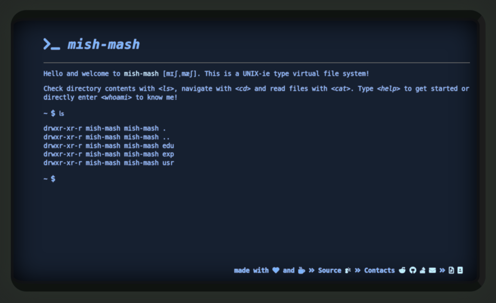

# * mish-mash*



A web shell, showing a virtual pseudo-terminal emulator with a command line interpreter, sitting on top of a virtual file system.

[**mish-mash**](https://www.196flavors.com/bulgaria-mish-mash/) is a great way to present yourself. It can be a CV or a personal site.

## Install

Get source code

``` bash
git clone https://github.com/Anarcroth/mish-mash.git
```

Navigate in the project directory and run

``` javascript
npm install
```

and then start the application on [localhost](localhost:3000)

``` javascript
node server.js
```

## Setup

The command line sits on top of a virtual file system, written in NodeJS. The VFS allows you to give it any number of files in a file structure and those files will be shown on the screen.

There is a `.conf` file that sets up what you want to show on the screen. The file itself has an explanation for every field present. The most important thing is to **keep** the format of the fields, since it's parsed in a specific way. Failure to keep the format of the configuration will lead to **undefined** behavior.

**NOTE:** I've messed with the `.conf` file so that I can use it personally. I think that it has a clear structure and there isn't any need for a sample file for now.

There is also a directory called `contents`. In it are all of the *real* files that you want to be mapped to the specified files in `.conf`. They are read as plain text and can be seen on the screen when the application is run.

Here are the supported commands:

`ls` - Lists directory contents. \
`cd` - Changes the working directory. \
`pwd` - Prints name of current/working directory. \
`cat` - Concatenates files and print on the standard output. \
`date` - Prints or set the system date and time. \
`echo` - Displays a line of text. \
`exit` - Ends current session. \
`help` - Prints help, or, if specified, prints a specific help listing of a command. \
`clear` - Clears the screen from all text. \
`whoami` - Prints out personal data for the owner of this CV.

**NOTE:** If you want to use or dig deeper into the VFS, then check out the [full implementation repo](https://github.com/Anarcroth/jayVFS).

## Contributions

All contributions are welcome! If you have an idea for an new feature, feel free to add it or open a task for it.
